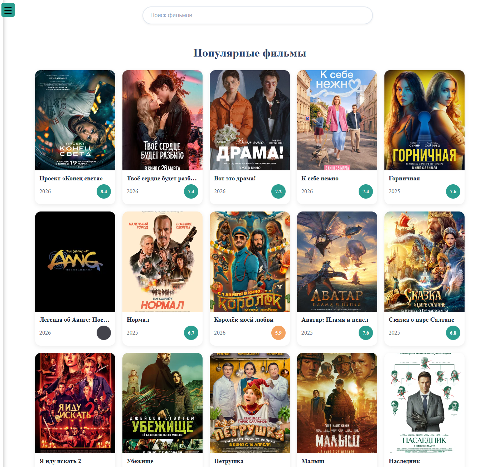
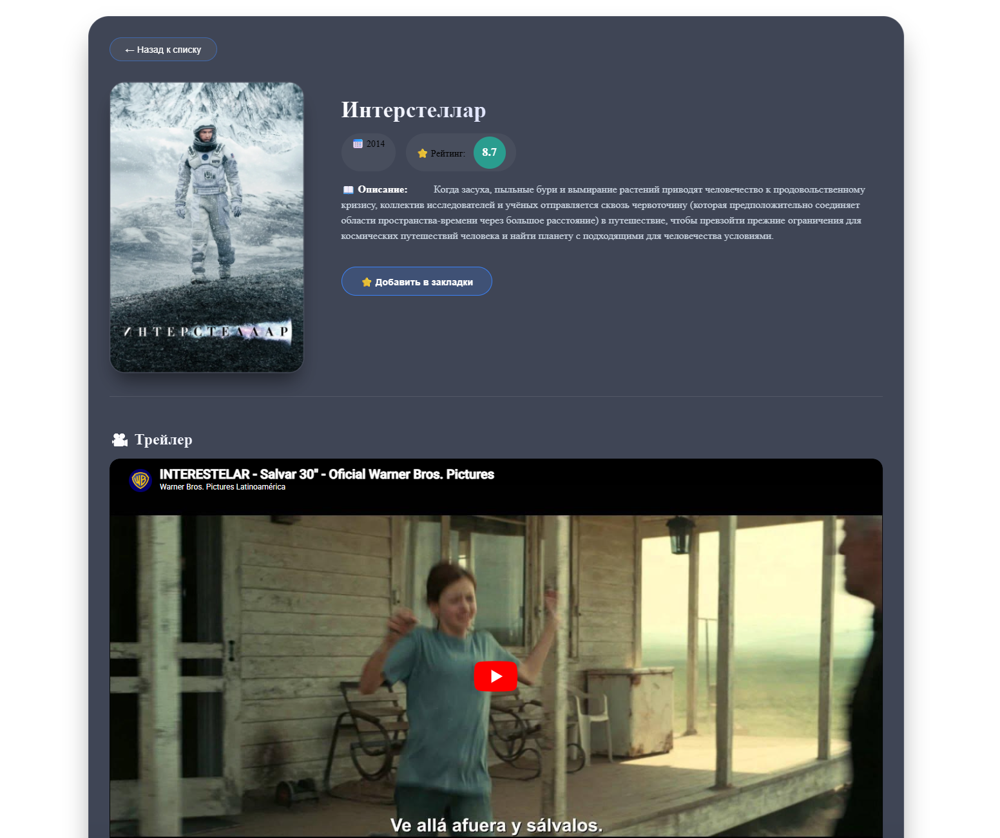
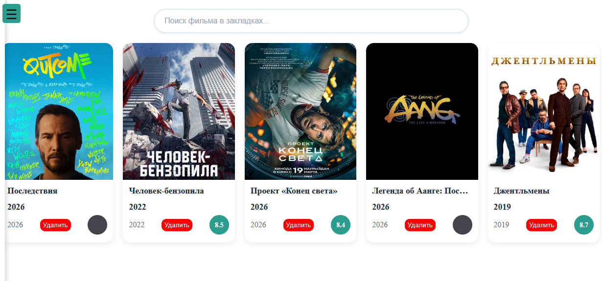
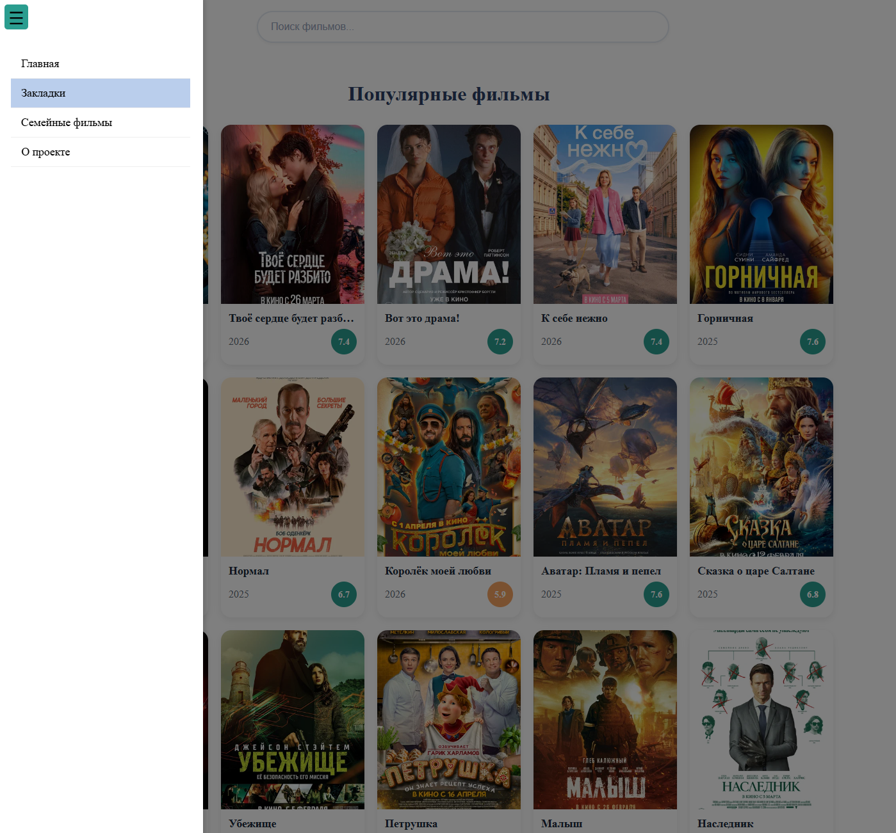

# 🎬 Movie Explorer – your personal movie guide

A feature-rich React application that lets you discover popular and family‑friendly movies, search for any film, view detailed info (trailers, ratings, descriptions), save bookmarks, and explore similar movies – all powered by the **Kinopoisk API Unofficial**.

🌐 **Live Demo:** [http://gramilya.xyz/](http://gramilya.xyz/)

---

## 📸 Screenshots

| Home Page (Popular Movies) | Movie Details + Trailer |
|----------------------------|-------------------------|
|  |  |

| Search Results | Bookmarks |
|----------------|-----------|
|  |  |

> *Replace the file names with your actual screenshots.*

---

## ✨ Features

- **🔥 Top 100 Popular Movies** – browse the most popular films with pagination.
- **👨‍👩‍👧‍👦 Family Movies** – a separate collection of family‑friendly films (different API endpoint).
- **🔍 Instant Search** – search movies by keyword with debounce (avoids excessive API calls).
- **📄 Detailed Film Page** – view full description, year, rating, poster, and **YouTube trailer** (if available).
- **🎬 Similar Movies** – see recommendations based on the current film.
- **🔖 Bookmarks** – add/remove movies to your personal list; data persists in `localStorage`.
- **📱 Fully Responsive** – works seamlessly on desktop, tablet, and mobile.
- **⚡ Performance optimised** – pagination, request cancellation, and caching reduce API limits.

---

## 🛠️ Tech Stack

- **React 18** (functional components, hooks)
- **Vite** – blazing fast build tool
- **React Router DOM** – client‑side routing (optional, if used)
- **CSS3** – Flexbox, Grid, custom animations
- **Kinopoisk API Unofficial** – real movie data
- **localStorage** – bookmark persistence
- **Debounce & AbortController** – search optimisation and request cancellation

---

## 🚀 Getting Started

### Prerequisites
- Node.js (v16+)
- npm or yarn

### Installation

```bash
git clone https://github.com/EvenTailer/Kinopoisk-Movie-API-on-React-Vite.git
cd my-app
npm install
npm run dev
Open http://localhost:5173 to see the app.

Build for production
bash
npm run build
The output will be in the dist folder, ready to deploy.

🔑 API Key
The project uses the Kinopoisk API Unofficial.
A demo API key is included in the code, but for production you should register your own key and replace it in hooks/useKinopoisk.js.

📁 Project Structure
text
src/
├── components/       # React components (Arena, CharacterHero, etc.)
├── hooks/            # Custom hooks (useKinopoisk, useKeyboard, etc.)
├── assets/           # Images, icons
├── App.jsx           # Main app component
├── main.jsx          # Entry point
└── style.css         # Global styles
🌟 Future Improvements
User accounts (Firebase / Node.js backend)

Global leaderboard for bookmarked films

Dark/light theme toggle

More filters (genre, year, rating)

📄 License
MIT

🙏 Acknowledgements
Kinopoisk API Unofficial for providing movie data.

Icons and design inspiration from various Dribbble shots.

Made with ❤️ by Ilya Gramatnev